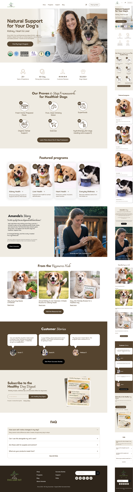

# $\color{green}\textsf{Five Leaf Pet}$

$\color{limegreen}\text{Учебная работа}$

## $\color{mediumblue}\text{Описание работы:}$

Интернет магазин. Сайт для продажи витаминов и биологических добавок для собак.

Работа на основе курса "Figma To WordPress". Автор - [**Вадим Прокопчук**](https://wp.from0to1.com.ua/lang-index.html).

**Цели и задачи работы:**

❗ Освоение современного FSE-стандарта разработки тем WordPress (Full Site Editing).

❗ Практика переноса макета из Figma в WordPress без использования конструкторов страниц.

❗ Работа с Gutenberg-редактором: паттерны, шаблоны, части шаблонов, цикл запроса.

❗ Интеграция плагина WooCommerce для построения полноценного интернет-магазина.

❗ Кастомная стилизация WordPress и WooCommerce блоков через CSS и JavaScript.

❗ Подключение CRM-системы и реализация форм email-рассылки.

❗ Настройка адаптивной вёрстки в рамках WordPress FSE-темы.

❗ Перенос сайта с локального сервера на хостинг.

🎯 $\color{mediumblue}\textsf{Основная задача}$ — изучение профессионального подхода к разработке коммерческих сайтов и интернет-магазинов на WordPress с нуля.

---

Макет -> [**Figma**](https://www.figma.com/design/osf21aWzyjO5GWdiwqUyEe/five-leaf-pet-README-version?node-id=0-1&p=f&t=rsWc7iuJJvI3wU1y-0)

Результат работы -> [**Сайт**](https://five-leaf-pet.artiom-mezheynikov.ru/)

---

## $\color{mediumblue}\text{Темы для изучения на курсе}$:

☑️ Локальные серверы для WordPress-разработки (MAMP, LocalWP). Хостинги и домены. MySQL и phpMyAdmin.

☑️ Установка WordPress, создание базы данных, первоначальная настройка проекта.

☑️ Структура файлов WordPress-темы. Стартовая тема: `style.css`, `theme.json`, `functions.php`.

☑️ FSE-стандарт (Full Site Editing). Файл `theme.json`: версии, настройки `appearanceTools`, `layout`, пресеты шрифтов, цветов и отступов.

☑️ FSE-редактор WordPress-админки: шаблоны страниц, паттерны, части шаблонов (header, footer, main). Разница между паттернами и шаблонами. Синхронизируемые и несинхронизируемые паттерны.

☑️ Создание и стилизация Header и Footer через FSE-редактор. Плагин Safe SVG для загрузки SVG-иконок.

☑️ Подключение кастомных стилей и скриптов через `functions.php`. WordPress-хуки `add_action` и `wp_enqueue_scripts`.

☑️ Создание индивидуальных FSE-шаблонов страниц. Корректный рендеринг семантических тегов (`<header>`, `<main>`, `<footer>`).

☑️ Интеграция плагина WooCommerce: страницы магазина, навигация, иконка корзины (мини-корзина).

☑️ Записи, рубрики и ярлыки WordPress. Создание FSE-шаблонов для записей (`Отдельно Запись`, произвольные шаблоны).

☑️ WordPress-элемент «Цикл запроса»: настройка, фильтрация по таксономии, вывод изображения и заголовка записи как ссылок. Блоки «нет результатов» и пагинация.

☑️ Плагин Yoast Duplicate Post для дублирования записей и страниц.

☑️ Плагин Custom Post Type UI (CPT UI) для создания пользовательских типов записей. FSE-шаблоны под пользовательские записи.

☑️ Кастомная стилизация WordPress-элементов силами CSS.

☑️ Блок-фильтр (Tabs) для записей: HTML через произвольный блок, стилизация через CSS, JavaScript-логика фильтрации по тегам-меткам .

☑️ Интеграция CRM-системы MailerLite (альтернатива Brevo для Беларуси): плагины Contact Form 7, CF7 Connector, Centous Integration. Создание форм с shortcode, группы для сбора email-адресов.

☑️ Настройка WooCommerce: добавление товаров, категории, краткое описание, изображения товаров, группированные товары, настройка цен и налогов.

☑️ Стилизация WooCommerce-элементов: «Коллекция товаров», «Фильтр товаров», «Выбор товара вручную», «Рекомендуемый товар». Кастомная стилизация `<select>` через CSS и псевдоэлементы.

☑️ Реализация переключения отображения товаров (сетка/список) через JavaScript и динамическое добавление CSS-классов.

☑️ PHP-фильтры для WooCommerce в `functions.php`: суммирование цен группированного товара, ограничение количества товаров на странице.

☑️ Создание кастомных WordPress-блоков (файловая структура: `block.json`, `index.js`, `render.php`). Регистрация блоков через `add_action('init', ...)`. Интеграция с плагином ACF (Advanced Custom Fields) для наполнения уникальным контентом каждого товара.

☑️ Подключение Gutenberg FSE-редактора к странице товара WooCommerce через PHP-фильтр `use_block_editor_for_post_type`.

☑️ Создание FSE-шаблона страницы блога. Якорные ссылки в WordPress-редакторе.

☑️ Настройка приёма платежей в WooCommerce на примере плагина WayForPay. Запуск интернет-магазина, настройка налогов.

☑️ Вывод количества товаров на иконке корзины через элемент WooCommerce «Мини-корзина» и его кастомизация.

☑️ Полный цикл переноса сайта с локального сервера (MAMP) на реальный хостинг:

    - Экспорт базы данных и архивация файлов проекта.
    - Создание поддомена и базы данных на хостинге.
    - Перенос файлов через FTP-клиент (FileZilla).
    - Настройка подключения к базе данных в `wp-config.php`.
    - Обновление URL-адресов через SQL-запросы и плагин **Better Search Replace**.
    - Настройка постоянных ссылок и финальная проверка работоспособности.

☑️ Изучение основ монетизации навыков WordPress-разработчика. Построение работы на фрилансе.

## $\color{mediumblue}\text{Технологии, инструменты и способы разработки }$:

✅ WordPress (FSE / Full Site Editing)
✅ Gutenberg
✅ Figma
✅ PHP
✅ MySQL
✅ JS
✅ CSS3
✅ HTML5
✅ VS Code
✅ MAMP
✅ phpMyAdmin
✅ FileZilla
✅ Git
✅ Flexbox
✅ CSS Grid
✅ Адаптивная вёрстка
✅ CSS-счётчики
✅ CSS-функции
✅ `functions.php`
✅ WordPress Hooks (Actions & Filters)
✅ `wp-config.php`
✅ Регистрация кастомных Gutenberg-блоков через PHP
✅ WooCommerce товары, категорий, цены
✅ WooCommerce-блоки: «Коллекция товаров», «Фильтр товаров», «Рекомендуемый товар», «Выбор товара вручную»
✅ WooCommerce корзина
✅ WooCommerce (запуск магазина)
✅ WayForPay
✅ Custom Post Type UI (CPT UI)
✅ ACF
✅ Yoast Duplicate Post
✅ Safe SVG
✅ CF-7
✅ CF7 Connector
✅ MailerLite(CRM)
✅ Centous Integration
✅ Better Search Replace
✅ Создание форм подписки

---

## $\color{orange}\text{Основные страницы}$:

$\color{orange}\text{➡}$ [**Homepage**](https://five-leaf-pet.artiom-mezheynikov.ru/home/)

$\color{orange}\text{➡}$ [**Programs**](https://five-leaf-pet.artiom-mezheynikov.ru/programs/)

$\color{orange}\text{➡}$ [**Health programm**](https://five-leaf-pet.artiom-mezheynikov.ru/health/heart-health/) (_Одна из страниц программ_)

$\color{orange}\text{➡}$ [**Article recipe**](https://five-leaf-pet.artiom-mezheynikov.ru/2026/05/14/gentle-support-recipe-salmon-pumpkin-mix/) (_Одна из страниц записей рецепров_)

$\color{orange}\text{➡}$ [**Shop**](https://five-leaf-pet.artiom-mezheynikov.ru/shop/)

$\color{orange}\text{➡}$ [**Product page**](https://five-leaf-pet.artiom-mezheynikov.ru/product/dog-greens/) (_Заполненная страница с товаром_)

$\color{orange}\text{➡}$ [**Cart**](https://five-leaf-pet.artiom-mezheynikov.ru/cart/)
